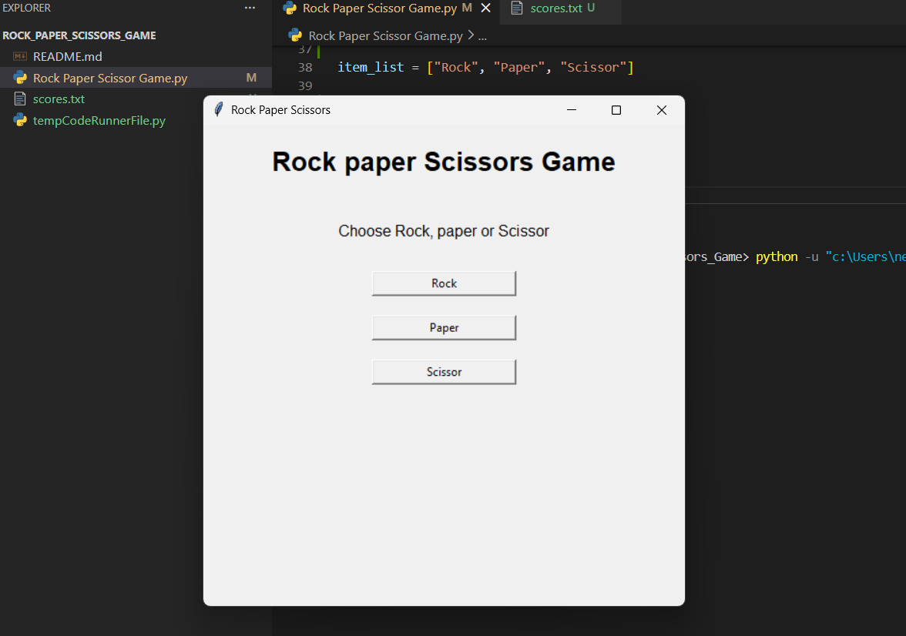
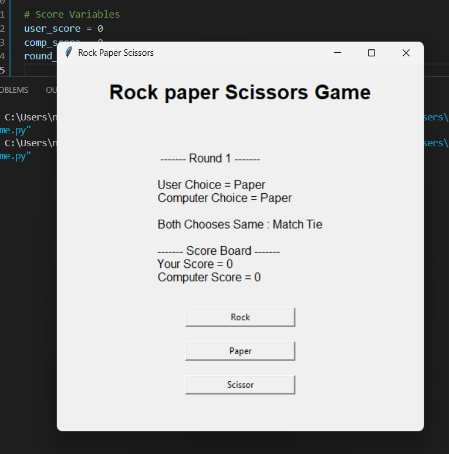
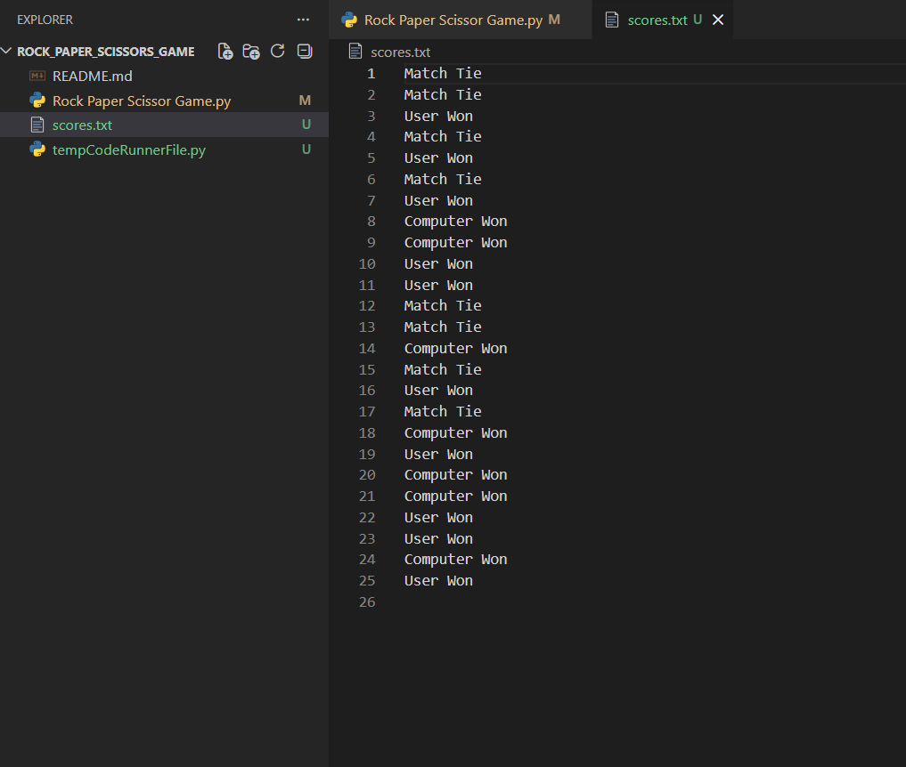
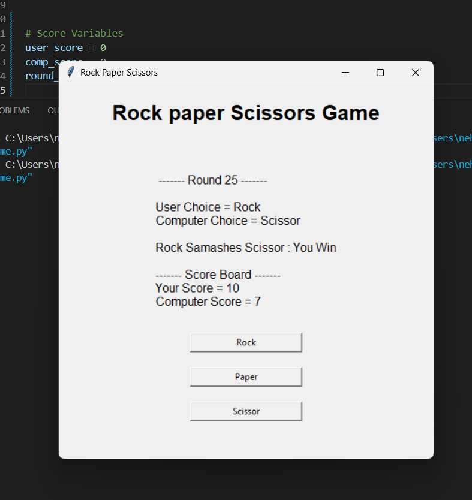

# Rock_Paper_Scissors_Game

# ✨About
Rock Paper Scissors Game built in 🐍 Python using the 🖥️ Tkinter GUI framework.
The objective of this project was to create an interactive user experience, clean game logic implementation with good event handling capabilities using Python.

The program offers a way to play a game of Rock Paper Scissors against the computer in a highly interactive GUI environment, while recording the score of the game dynamically throughout gameplay. This project showcases strong fundamentals of GUI design, conditional logic, functional programming, and user interaction handling.


# 🚀 Features
``` text
🎮 Interactive GUI Interface
🤖 Computer Random Choice Logic
🧠 Real-Time Winner Detection System
📊 Dynamic Score Tracking
🔁 Multiple Round Gameplay
⚡ Fast and Responsive User Experience
🖱️ Button-Based User Interaction
🎨 Clean and User-Friendly Design
🧩 Structured and Readable Python Code
```

# 🛠️ Tech Stack


# ✨ Screenshots

<p align="center">


</p>

<p align="center">


</p>


# 📂 Folder Structure

``` text
Rock-Paper-Scissors/
│
├── Rock Paper Scissor Game.py
│
├── scores.txt
│
├── tempCodeRunnerFile.py
│
├── Images
│
└── README.md
```


# 🎯 Project Objective

The core purpose of this project is to enhance the proficiency in Python programming language and GUI programming through the creation of an application that can be used in actual play.

This project also helps in understanding:
``` text
• Event-driven programming 
• GUI components management 
• Conditional game logic
• Functions-based design
• User interaction management
```